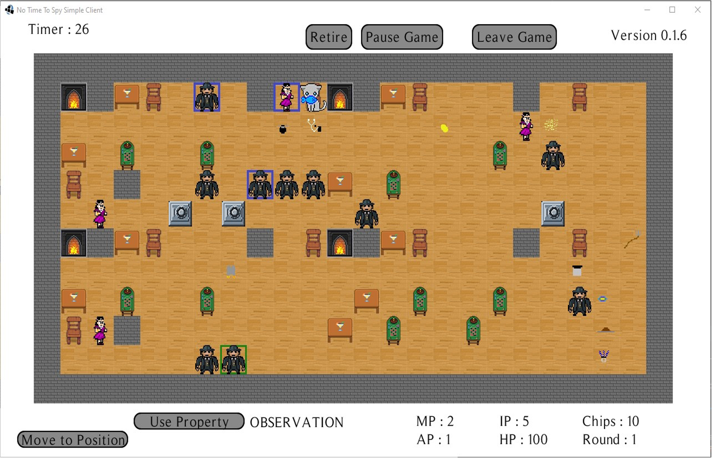
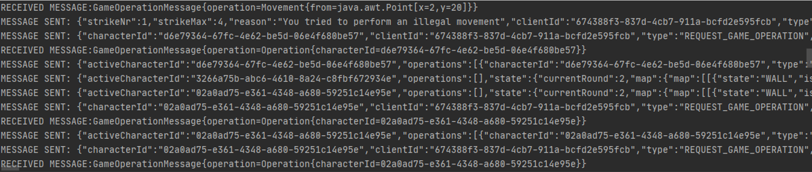

# Softwareproject Ulm University Game Bachelors
During the 4th bachelors semester at ulm university, my team and I had to develop a James Bond themed multiplayer board game.
Therefore we implemented a server (backend) and a simple client (frontend). Our main focus was to implement an efficient and robust server instead of engineering a great UI within the frontend.

## Sample picture of the game board

## Sample picture of backend/frontend communication

